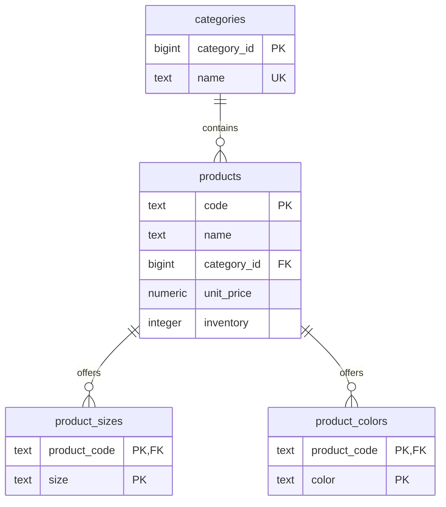

# DB schema

商品以 `code` 為主鍵，一個 code 共用一份單價與總庫存。尺寸與顏色是各自獨立的可選集合，不記錄尺寸 × 顏色組合的庫存。

## Mermaid ER diagram

## 欄位與限制

所有欄位皆為 `NOT NULL`。完整 DDL 以 [migration](../migrations/versions/0001_create_normalized_product_catalog.py) 為準。

| 表 | 主鍵與限制 |
| --- | --- |
| `categories` | `category_id` 為 bigint identity；`name` 唯一、去除前後空白且非空 |
| `products` | `code` 為 text 主鍵；code、name 去除前後空白且非空；`category_id` 為外鍵並建立查詢索引 |
| `product_sizes` | 複合主鍵 `(product_code, size)`；size 去除前後空白且非空，同商品不能重複尺寸 |
| `product_colors` | 複合主鍵 `(product_code, color)`；color 去除前後空白且非空，同商品不能重複顏色 |

- `unit_price` 使用 `numeric(12,2)`，範圍 0 至 9999999999.99。
- `inventory` 使用非負 integer，範圍 0 至 2147483647。
- 商品分類外鍵採 `ON DELETE RESTRICT`，仍被引用的分類不能刪除。
- 尺寸／顏色外鍵採 `ON UPDATE CASCADE`、`ON DELETE CASCADE`；刪除商品會清除明細，分類保留。
- code 建立後不可修改、尺寸與顏色各至少一項，由 [API 驗證](api-contract.md) 保證。DB 外鍵本身允許商品沒有明細，因此圖中為零到多筆。

## 正規化

`code` 決定商品名稱、分類、單價與庫存；`category_id` 決定分類名稱。分類拆表，避免在每個商品重複保存共用分類名稱，商品屬性符合第三正規化。

尺寸與顏色各自一值一列，避免逗號字串與重複欄位；再拆成兩張明細表，消除兩個獨立多值集合形成的交叉組合。商品單價及庫存只存在 `products`，不因明細數量而重複。
