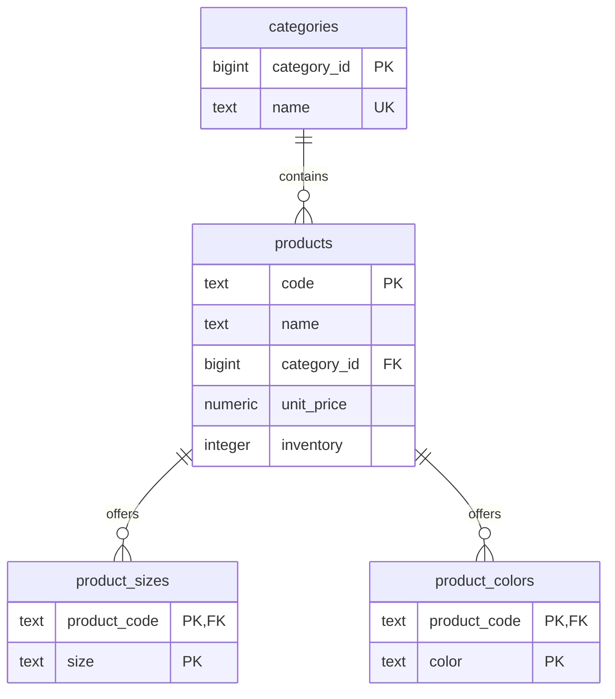

# 後端作業資料庫設計

依據 [GainMiles Python Online Test (2026).docx](<GainMiles Python Online Test (2026).docx>) 設計。技術方向為 Python、Flask、PostgreSQL；ticket 01 已以 SQLAlchemy models 與初始 migration 實作下述資料模型，商品 CRUD 仍待後續 tickets 完成。

已確認以 `products.code` 為商品主鍵，將尺寸、顏色各自拆成明細表，另以分類表管理共用分類。共四張表，在下述業務規則下符合第三正規化（3NF），也消除了尺寸、顏色之間的獨立多值重複。API 行為見 [API contract](api-contract.md)，執行方式見 [技術架構](architecture.md)。

## 需求與設計假設

文件要求商品 JSON CRUD API、透過 Docker 安裝 RDBMS，以及 README 中的服務啟動指令。原始資料如下：

| name | code | category | size | unit_price | inventory | color |
| --- | --- | --- | --- | ---: | ---: | --- |
| Star | A-001 | cloth | S、M | 200 | 20 | Red、Blue |
| Moon | A-002 | cloth | M、L | 300 | 10 | Red、White |
| Eagle | B-001 | pants | M、L | 100 | 23 | Green |
| Bird | B-002 | pants | S、M、L | 50 | 12 | Black |

使用者已確認庫存依文件管理：每個 `code` 一個總庫存。其他未明定的規則採用以下設計假設：

- `code` 在整個商品目錄中唯一且建立後不可透過 API 修改，同一商品的各尺寸、顏色共用此代碼。
- 一個商品屬於一個分類，有一組尺寸與一組顏色。
- 單價依文件放在商品層級；庫存已確認也屬於商品。A-001 的庫存 20 只記錄一次，不分配到各規格組合。
- 尺寸清單和顏色清單只表達可選值，不能據此斷言每個尺寸 × 顏色組合都有販售。
- 價格非負、最多兩位小數；庫存為非負整數。這些是本版設計選擇，並非題目明文規定。
- 不從 A/B 代碼前綴推導分類：四筆範例不足以建立此前綴規則。

## code 作為主鍵

`code` 是自然鍵，也就是原本就具有業務意義的識別值。在「全域唯一且建立後固定」的規則下，直接作為 `products` 的主鍵很適合這份作業；不需要另外增加無用途的商品 `id`。

這不代表所有表都只用 `code` 作主鍵。A-001 可以有 S 和 M，所以尺寸明細的主鍵必須是 `(product_code, size)`；顏色同理。

| 方案 | 優點 | 代價與適用條件 |
| --- | --- | --- |
| `code PRIMARY KEY`（本版） | 對應題目，關聯直接，不多一個商品識別欄位 | 改代碼時要同步更新外鍵；文字鍵會出現在各明細表 |
| `id PRIMARY KEY` + `code UNIQUE NOT NULL` | 內部關聯不受商品改碼影響 | 多一個識別欄位；適合代碼常改或後續關聯大量增加時 |

選自然鍵或代理鍵都可以正規化；增加 `id` 本身不會解決多值欄位或資料重複。本版 API 拒絕修改 `code`。DDL 保留 `ON UPDATE CASCADE` 以維持直接 SQL 改碼時的參照完整性，但這不是 API 支援改碼的承諾；主鍵及外鍵本身不保證代碼不可修改。

## 正規化過程

### 第一正規化 1NF

把 `S、M`、`Red、Blue` 當作字串存入一格，會混合多個需要獨立查詢的值。改成每筆尺寸明細一個尺寸、每筆顏色明細一個顏色。

在正規化的關聯模型中，不以逗號字串、JSON 或 PostgreSQL array 儲存這些集合。JSON API 仍可輸出陣列，API 格式不必等同資料表形狀。

### 第二正規化 2NF

若把所有資料攤成 `(code, size, color, name, category, unit_price, inventory)`，商品名稱、分類、單價與庫存只依賴 `code`，不依賴整個複合鍵 `(code, size, color)`。這會重複商品資料，形成部分依賴。

因此商品屬性留在 `products`，集合內容各自留在 `product_sizes`、`product_colors`。例如新增 A-001 的 L 號，不必複製名稱、價格或庫存。

### 第三正規化 3NF

本版的主要函數依賴如下：

```text
products:
  code -> name, category_id, unit_price, inventory

categories:
  category_id -> name
  name -> category_id  （分類名稱為另一個候選鍵）

product_sizes:
  候選鍵 = (product_code, size)，沒有非鍵欄位

product_colors:
  候選鍵 = (product_code, color)，沒有非鍵欄位
```

商品表不再同時存放 `category_id` 和 `category_name`，避免 `code -> category_id -> category_name` 的傳遞依賴。

嚴格而言，若只在商品表存一個分類名稱，且沒有其他分類屬性，也可以符合 3NF。抽出 `categories` 是為了共用分類、透過外鍵約束分類存在，以及集中處理改名，不是「值重複就必須拆表」。

尺寸和顏色目前只有值，沒有額外描述或管理需求，因此不再建立 `sizes`、`colors` 字典表。若之後要限制可用詞彙，或加入尺寸排序、顏色色碼，可再建立字典表並改用外鍵。

### 獨立多值關係

把 A-001 的 S/M 和 Red/Blue 放在同一張交叉表，會形成四列，只為表達兩個獨立集合。分成兩張明細表能分別表達這兩組多值關係，避免無意中把交叉乘積當成真實的商品規格組合。這也是第四正規化所處理的問題。

## 關聯與欄位



| 表 | 主鍵 | 其他欄位／限制 |
| --- | --- | --- |
| `categories` | `category_id` | `name` 不為空且唯一 |
| `products` | `code` | `name`、`category_id`、`unit_price`、`inventory` 必填 |
| `product_sizes` | `(product_code, size)` | 商品外鍵；同一商品不可重複尺寸 |
| `product_colors` | `(product_code, color)` | 商品外鍵；同一商品不可重複顏色 |

DB 允許商品暫時沒有尺寸或顏色明細，所以 ERD 使用零到多。API 已確認兩個陣列都不可為空，需要在寫入交易中驗證；單靠子表外鍵不會保證父表至少有一筆子資料。

## PostgreSQL DDL 草案

以下 SQL 保留作為設計參考；實際建表以已提交的 Alembic migration 為準，包含具名 constraints。

```sql
CREATE TABLE categories (
    category_id bigint GENERATED ALWAYS AS IDENTITY PRIMARY KEY,
    name text NOT NULL UNIQUE,
    CHECK (name = btrim(name) AND name <> '')
);

CREATE TABLE products (
    code text PRIMARY KEY,
    name text NOT NULL,
    category_id bigint NOT NULL
        REFERENCES categories (category_id) ON DELETE RESTRICT,
    unit_price numeric(12, 2) NOT NULL,
    inventory integer NOT NULL,
    CHECK (code = btrim(code) AND code <> ''),
    CHECK (name = btrim(name) AND name <> ''),
    CHECK (unit_price BETWEEN 0 AND 9999999999.99),
    CHECK (inventory >= 0)
);

CREATE TABLE product_sizes (
    product_code text NOT NULL
        REFERENCES products (code)
        ON UPDATE CASCADE ON DELETE CASCADE,
    size text NOT NULL,
    PRIMARY KEY (product_code, size),
    CHECK (size = btrim(size) AND size <> '')
);

CREATE TABLE product_colors (
    product_code text NOT NULL
        REFERENCES products (code)
        ON UPDATE CASCADE ON DELETE CASCADE,
    color text NOT NULL,
    PRIMARY KEY (product_code, color),
    CHECK (color = btrim(color) AND color <> '')
);

CREATE INDEX idx_products_category_id ON products (category_id);
```

採用 `text` 避免只因範例而任意限制商品代碼長度或固定為 `A-001` 格式。字串的大小寫視為不同值；API 實作時應一致處理輸入，不宜在不同入口各自轉換。

`numeric(12, 2)` 保存十進位精確值；範圍檢查同時排除 PostgreSQL 的特殊數值 NaN。超過兩位小數的輸入可能被型別轉換四捨五入，因此 API 必須在寫入 DB 前驗證並拒絕這種輸入。Python 對應使用 `Decimal`，JSON 金額格式見 API contract。

主鍵與唯一限制已有索引，不另外重複建立。兩張明細表的複合主鍵都以 `product_code` 開頭，可支援按商品查明細。`category_id` 另建索引，支援分類查詢。

刪除商品會一併刪除該商品的尺寸、顏色明細；仍被商品引用的分類不能刪除。商品及其尺寸、顏色的新增或更新需使用同一筆交易，避免留下部分更新。

## A-001 拆分範例

假設 cloth 的分類識別值為 1：

```text
categories
category_id | name
1           | cloth

products
code  | name | category_id | unit_price | inventory
A-001 | Star | 1           | 200.00     | 20

product_sizes             product_colors
product_code | size       product_code | color
A-001        | S          A-001        | Red
A-001        | M          A-001        | Blue
```

四筆範例完整拆分後應有 2 筆分類、4 筆商品、9 筆尺寸明細與 6 筆顏色明細，且每筆商品的單價與庫存只儲存一次。查詢時分別聚合尺寸、顏色；若直接同時 JOIN 兩張明細表，會產生交叉乘積，導致陣列重複或錯誤加總庫存。

尺寸與顏色依集合處理，本版不保存來源排列順序；API 的固定輸出排序見 API contract。

## 若改為依規格組合管理庫存

應新增 `product_variants`，至少包含 `product_code`、`size`、`color`、`inventory`，主鍵或唯一限制為 `(product_code, size, color)`。尺寸與顏色清單可由實際規格組合推導，避免維護兩份相同關係。

此時庫存改放在規格組合，商品總庫存由 `SUM(variant.inventory)` 推導。價格只有在不同規格售價不同時才需要移至規格組合。

原始的 A-001 庫存 20 無法推導 S/Red 等組合各有多少；也無法確定所有交叉組合都存在。不能把 20 複製到每個組合，或自行平均分配。這需要新增業務資料，並非單靠正規化可以求得。

## 技術參考

- [PostgreSQL Constraints](https://www.postgresql.org/docs/current/ddl-constraints.html)：主鍵、唯一限制、外鍵、CHECK 與級聯行為。
- [PostgreSQL Numeric Types](https://www.postgresql.org/docs/current/datatype-numeric.html)：numeric 精度、小數位及特殊數值。

原作業另要求：若使用 AI，提交時提供完整對話供參考。
